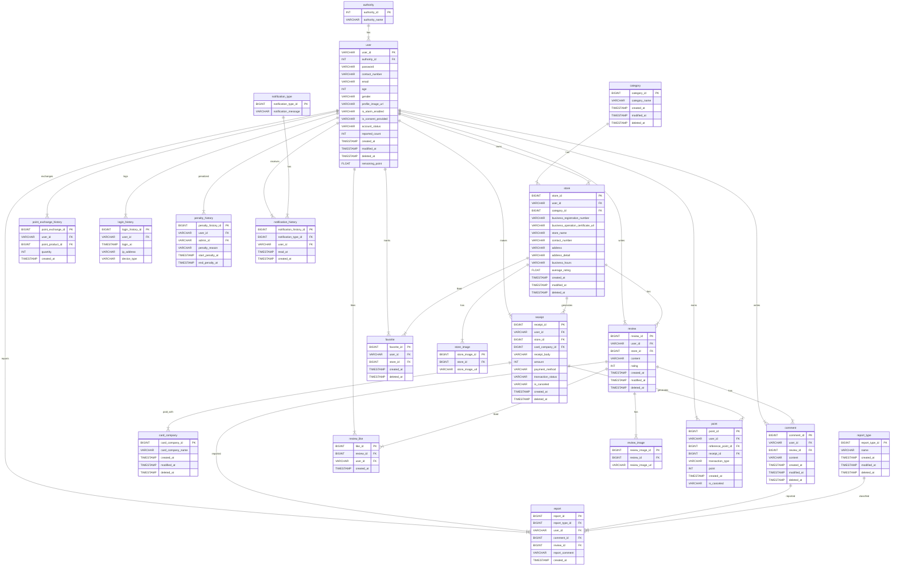

<il><h1>😈BILLon이 환경오염의 빌런이 되어 맞서겠습니다!🛡️</h1></il>
<il><h3>- 모바일 영수증으로 세상을 슬기롭게 -</h3></il>

 
### 목차

1. [Hello World!](#Hello-World!)
   - [Team DBDiBABiDiBU](#Team)
   - [Our Project](#Project)
2. [Project result](#Project-result)
   - [WBS](#WBS)
   - [요구사항 명세서](#요구사항-명세서)
   - [Usecase](#Usecase)
   - [ERD](#ERD)
   - [테이블 명세서](#테이블-명세서)
3. [Our Playground](#Our-Playground)  

  
<h1 id="Hello-World!">👋 Hello World!</h1>
<h3 id="Team">🪄 Team DBDiBABiDiBU</h3>

|**김태인**|**박성용**|**박양하**|
|:-----:|:-----:|:-----:|
||||
|<em>**PSY**</em>|<em>**C-Dragon**</em>|<em>**에임핵 냥꾼**</em>|

|**장건희**|**장현영**|**하채린**|
|:-----:|:-----:|:-----:|
||||
|<em>**쁘띠건희**</em>|<em>**장PM**</em>|<em>**안방 갱스터**</em>|

 
<h3 id="Project">📹 Our Project</h3>
<h5>기술 스택</h5>

  
  
  
  
  

 
<h5>프로젝트 목적</h5>
본 프로젝트는 종이 영수증이 환경 오염의 주요 원인임을 인식하고, 이를 해결하기 위해 모바일 영수증 통합 관리 시스템을 구축하고자 합니다. 소비자와 판매자가 모두 편리하게 이용할 수 있는 이 시스템은 다양한 기능을 제공하여 종이 영수증 사용을 최소화하고, 환경 보호에 기여하는 것을 목표로 합니다.
    
 주요 기능으로는 모바일 영수증 발행 및 통합 관리, 간편한 리뷰 작성, 포인트 적립 및 리워드 시스템, 영수증 조회, 소비 패턴 분석, 매장별 데이터 분석 등이 있으며, 이를 통해 사용자들은 보다 스마트하고 친환경적인 소비를 실현할 수 있습니다.
   

    
<b>🔍프로젝트 기획안 자세히 보기</b>

    

<h1>1. 개요</h1>

## 1-1. 배경

현재 종이 영수증은 환경 오염의 주요 원인 중 하나로, 매년 수십억 장이 발행되며 엄청난 양의 종이 낭비와 탄소 배출을 초래하고 있습니다. 대부분의 종이 영수증은 BPA(비스페놀 A) 등의 유해 화학물질을 포함하고 있어 재활용이 불가능하며, 결국 환경 오염으로 이어집니다.

대한민국 정부도 이러한 문제를 인식하여 2020년 민간 업체들과 협업하여 종이 영수증을 전자 영수증으로 관리하는 통합 플렛폼을 구축하는 프로젝트를 진행하였으나, 민간 업체들과의 통합이 진행되지 않아 개별적으로 서비스를 제공하는 형태로 자리잡았으며, 이는 소비자들로 하여금 여러가지 제휴사에 대한 어플을 각각 다운받아야 하는 번거로움을 야기하였습니다.

이로 인해 소비자들은 아직도 종이 영수증과 SMS 알림에 익숙한 형태를 보이고 있습니다.

## 1-2. 문제점 및 해결방안

### 1-2-1. 소비자 관점에서의 문제점 및 해결방안

| 문제점 | 해결 방안 |
|--------|-----------|
| **여러 개의 영수증 앱을 설치해야 하는 불편함** | 개별 업체 별 앱이 아닌 **통합 플랫폼 제공**으로 하나의 앱에서 다양한 제휴사 영수증을 관리 |
| **QR 코드 스캔 방식의 번거로움** | QR 코드 대신 **전화번호 입력 방식** 도입으로 간편하게 영수증 수령 가능 |
| **소비자가 자신의 소비 패턴을 한눈에 파악하기 어려움** | **소비 데이터 분석 기능**을 제공하여 월 별 소비 패턴 및 소비 총량을 시각화된 리포트로 제공 |

### 1-2-2. 판매자 관점에서의 문제점 및 해결방안

또한 현재 **교환·환불 시 영수증을 반드시 지참 해야 하는 관행**이 여전히 남아 있으며, **전자 문서 법 상 모바일 영수증도 법적 효력을 가지지만 법적인 강제성이 없어 판매자들이 이를 인정하지 않는 문제**가 발생하고 있습니다.

> 전자문서법 요약
> 
> ##### 목적
> 전자문서와 전자거래의 법적 효력을 인정하고, 그 안전성 및 신뢰성 확보를 목적으로 합니다.
> 
> ##### 핵심 내용
> 1. **전자문서 효력**
>    - 전자문서는 **종이 문서와 동일한 법적 효력**을 가집니다.
> 2. **서면 요건**
>    - 전자문서는 특정 조건을 만족하면 서면으로 인정됩니다.
>    - 단, 다른 법령에 특별한 규정이 있거나 성질상 전자적 형태가 허용되지 않는 경우 제외.
> 3. **보관 기간**
>    - 전자문서는 **5년간 보관** 후 파기해야 합니다.
> 4. **전자거래**
>    - 전자적 방식으로 이루어지는 재화 및 용역 거래입니다.

이러한 문제로 인해 소비자들은 여전히 종이 영수증을 요구 받으며, 모바일 영수증의 활성화가 어려운 상황입니다. 따라서 판매자의 참여를 유도하기 위해 다음과 같은 솔루션을 제공합니다.

| 문제점 | 해결 방안 |
|--------|-----------|
| **소상공인들은 기존 POS 시스템과 연동 부담이 큼** | **간편한 API 및 웹 기반 솔루션** 제공으로 부담 최소화 및 손쉬운 도입 가능 |
| **모바일 영수증을 인정하지 않는 판매자가 많음** | **판매자에게 법적 근거 및 모바일 영수증 활용 가이드 제공**, 소비자 편의성 증대를 통한 매출 증대 유도 |
| **판매자가 매출 및 영수증 데이터를 효과적으로 관리하기 어려움** | **매출 및 영수증 데이터 분석 기능** 제공하여 월별 총 판매 금액, 일별 평균 판매량 등의 데이터 제공 |

환경 오염 문제 해결을 위한 친환경 모바일 영수증 시스템을 구축함으로써 불필요한 종이 사용을 줄이고, 환경 보호에 실질적으로 기여하는 동시에, 기존 모바일 영수증 시스템의 한계를 극복하여 소비자와 가맹점 모두에게 최적화된 사용자 중심의 친환경 솔루션을 제공하는 저희는 다음과 같은 기능을 제공합니다.
 
# 2. 주요 기능 소개

## 2-1. 모바일 영수증 발행 및 통합 관리
|  |"단 하나의 앱으로 모든 영수증 통합 관리"  회원 결제 시 전화번호 입력만으로 모바일 영수증이 자동 발급되도록 구현하며 개별 가맹점 또는 카드사별 앱을 따로 설치할 필요 없이 하나의 플랫폼에서 모든 영수증을 확인하고 관리할 수 있는 기능을 제공합니다. 영수증은 자동 저장되며, 검색 필터 및 카테고리별 정리 기능을 제공하여 관리의 편의성을 극대화합니다.|
|-|:-|

 

## 2-2. 모바일 영수증을 통한 리뷰 작성
|"영수증 촬영 및 첨부 없이 간편하게 리뷰 작성"  기존의 리뷰 작성 방식에서는 영수증을 촬영하고 첨부하는 번거로운 과정이 필요했지만, 본 서비스는 모바일 영수증을 기반으로 간편하게 리뷰를 작성할 수 있도록 지원합니다. 가맹점은 작성된 리뷰에 직접 답변할 수 있으며, 신뢰도 높은 리뷰는 상단에 노출되는 기능을 제공합니다.||
|-:|-|

 

## 2-3. 포인트 적립 및 리워드 시스템
||"환경도 지키고, 지갑도 지키는 스마트한 소비"  모바일 영수증을 선택한 사용자에겐 자동으로 환경 보호 포인트 적립 혜택을 제공하며 적립된 포인트는 에코백, 일반쓰레기 봉투, 상품권, 기프트 카드 등의 물품 교환으로 사용이 가능합니다.|
|-|:-|

  

## 2-4. 영수증 조회
|"필요한 영수증을 쉽고 빠르게 검색 및 관리"  발행된 영수증을 날짜, 금액, 결제 수단, 가맹점 등 다양한 기준으로 필터링하여 조회할 수 있는 기능을 제공하며 이를 통해 회원은 특정 소비 영역의 지출 내역을 직관적으로 확인할 수 있습니다.||
|-:|-|

 

## 2-5. 소비 패턴 분석을 통한 맞춤형 지출 관리
||"개인별 소비 패턴을 한눈에 분석 및 관리"  회원의 소비 패턴을 분석하여 월별 소비 추이, 동일 연령대 평균 지출 대비 분석, 카테고리별 소비 비중에 대한 정보를 제공합니다. 이를 통해 회원은 시각적으로 한번에 소비 증가율 또는 절감율을 파악할 수 있습니다.|
|-|:-|

 

## 2-6. 매장별 데이터 분석 및 가맹점 지원
|"영수증 데이터를 활용한 스마트한 매장 운영"  가맹점은 영수증 데이터를 바탕으로 기간별 매출 및 판매량 분석 기능을 제공하여 매장 운영 최적화에 대한 지원을 제공합니다. 또한 소비 패턴 데이터를 기반으로 인기 상품 및 기간별 판매 데이터를 분석하여 재고 관리와 프로모션 운영에 대한 솔루션을 제공하여 효율적인 매장 운영을 가능케 합니다.||
|-:|-|
   

  

<h1 id="Project-result">🗂️ Project result</h1>
<h3 id="WBS">📝 WBS</h3>

    
WBS 자세히 보기

    

    
    <a href="https://www.notion.so/WBS-1972fdb1414880e5927bfca57c78818e" style="width: 800px; height: auto;"><text><strong>WBS 바로가기↗️</strong></text></a>

 
<h3 id="요구사항-명세서">📣 요구사항 명세서</h3>
   <a href="https://docs.google.com/spreadsheets/d/1RzO2sKIcxcg2UVJ3Kifqxh2DRa5JRaMFYHZ_KiVaFS8/edit?gid=1507164768#gid=1507164768"><text><strong>요구사항 명세서 바로가기↗️</strong></text></a>
 
<h3 id="Uscase">👤 Uscase</h3>

    
Uscase 자세히 보기

    

    
    <a href="https://www.notion.so/Usecase-003909a8357242e8bf20ac5af717e914" style="width: 800px; height: auto;"><text><strong>Usecase 바로가기↗️</strong></text></a>

 
<h3 id="ERD">📌 ERD</h3>

    
ERD 자세히 보기

    

    

 
<h3 id="테이블-명세서">📻 테이블 명세서</h3>
    <a href="https://docs.google.com/spreadsheets/d/1vawkgNNk6gMcrAKfkHxGdXmqxrvi5nloG8M331hdnIQ/edit?gid=0#gid=0"><text><strong>테이블 명세서 바로가기↗️</text></a>
 

<h1 id="Our-Playground">🗂️ Our Playground</h1>

   <a href="https://www.notion.so/be15_1st_Project_DB-5c52900ed26b42ad812641a28fe85249"><text><strong>| 📓 Notion |</text></strong></a>

