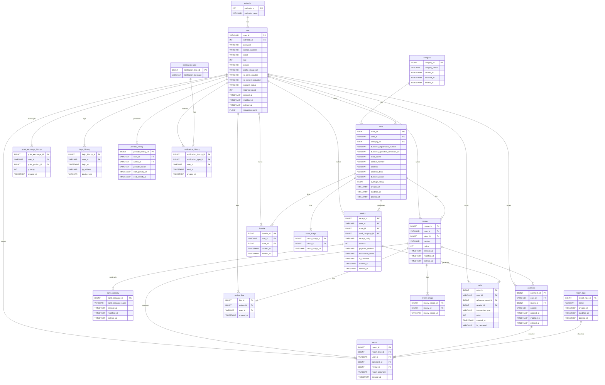

```mermaid
erDiagram

    authority {
        INT authority_id PK
        VARCHAR authority_name
    }

    category {
        BIGINT category_id PK
        VARCHAR category_name
        TIMESTAMP created_at
        TIMESTAMP modified_at
        TIMESTAMP deleted_at
    }

    user {
        VARCHAR user_id PK
        INT authority_id FK
        VARCHAR password
        VARCHAR contact_number
        VARCHAR email
        INT age
        VARCHAR gender
        VARCHAR profile_image_url
        VARCHAR is_alarm_enabled
        VARCHAR is_consent_provided
        VARCHAR account_status
        INT reported_count
        TIMESTAMP created_at
        TIMESTAMP modified_at
        TIMESTAMP deleted_at
        FLOAT remaining_point
    }

    store {
        BIGINT store_id PK
        VARCHAR user_id FK
        BIGINT category_id FK
        VARCHAR business_registration_number
        VARCHAR business_operation_certificate_url
        VARCHAR store_name
        VARCHAR contact_number
        VARCHAR address
        VARCHAR address_detail
        VARCHAR business_hours
        FLOAT average_rating
        TIMESTAMP created_at
        TIMESTAMP modified_at
        TIMESTAMP deleted_at
    }

    notification_type {
        BIGINT notification_type_id PK
        VARCHAR notification_message
    }

    report_type {
        BIGINT report_type_id PK
        VARCHAR name
        TIMESTAMP created_at
        TIMESTAMP modified_at
        TIMESTAMP deleted_at
    }

    card_company {
        BIGINT card_company_id PK
        VARCHAR card_company_name
        TIMESTAMP created_at
        TIMESTAMP modified_at
        TIMESTAMP deleted_at
    }

    receipt {
        BIGINT receipt_id PK
        VARCHAR user_id FK
        BIGINT store_id FK
        BIGINT card_company_id FK
        VARCHAR receipt_body
        INT amount
        VARCHAR payment_method
        VARCHAR transaction_status
        VARCHAR is_canceled
        TIMESTAMP created_at
        TIMESTAMP deleted_at
    }

    review {
        BIGINT review_id PK
        VARCHAR user_id FK
        BIGINT store_id FK
        VARCHAR content
        INT rating
        TIMESTAMP created_at
        TIMESTAMP modified_at
        TIMESTAMP deleted_at
    }

    comment {
        BIGINT comment_id PK
        VARCHAR user_id FK
        BIGINT review_id FK
        VARCHAR content
        TIMESTAMP created_at
        TIMESTAMP modified_at
        TIMESTAMP deleted_at
    }

    review_like {
        BIGINT like_id PK
        BIGINT review_id FK
        VARCHAR user_id FK
        TIMESTAMP created_at
    }

    review_image {
        BIGINT review_image_id PK
        BIGINT review_id FK
        VARCHAR review_image_url
    }

    point {
        BIGINT point_id PK
        VARCHAR user_id FK
        BIGINT reference_point_id FK
        BIGINT receipt_id FK
        VARCHAR transaction_type
        INT point
        TIMESTAMP created_at
        VARCHAR is_canceled
    }

    point_exchange_history {
        BIGINT point_exchange_id PK
        VARCHAR user_id FK
        BIGINT point_product_id FK
        INT quantity
        TIMESTAMP created_at
    }

    favorite {
        BIGINT favorite_id PK
        VARCHAR user_id FK
        BIGINT store_id FK
        TIMESTAMP created_at
        TIMESTAMP deleted_at
    }

    store_image {
        BIGINT store_image_id PK
        BIGINT store_id FK
        VARCHAR store_image_url
    }

    login_history {
        BIGINT login_history_id PK
        VARCHAR user_id FK
        TIMESTAMP login_at
        VARCHAR ip_address
        VARCHAR device_type
    }

    report {
        BIGINT report_id PK
        BIGINT report_type_id FK
        VARCHAR user_id FK
        BIGINT comment_id FK
        BIGINT review_id FK
        VARCHAR report_comment
        TIMESTAMP created_at
    }

    penalty_history {
        BIGINT penalty_history_id PK
        VARCHAR user_id FK
        VARCHAR admin_id FK
        VARCHAR penalty_reason
        TIMESTAMP start_penalty_at
        TIMESTAMP end_penalty_at
    }

    notification_history {
        BIGINT notification_history_id PK
        BIGINT notification_type_id FK
        VARCHAR user_id FK
        TIMESTAMP read_at
        TIMESTAMP created_at
    }

    authority ||--|{ user : has
    category ||--|{ store : has
    user ||--|{ store : owns
    user ||--|{ receipt : makes
    user ||--|{ review : writes
    user ||--|{ comment : writes
    user ||--|{ review_like : likes
    user ||--|{ point : earns
    user ||--|{ point_exchange_history : exchanges
    user ||--|{ favorite : marks
    user ||--|{ login_history : logs
    user ||--|{ report : reports
    user ||--|{ penalty_history : penalized
    user ||--|{ notification_history : receives
    store ||--|{ review : has
    store ||--|{ favorite : liked
    store ||--|{ store_image : has
    store ||--|{ receipt : generates
    review ||--|{ comment : has
    review ||--|{ review_like : liked
    review ||--|{ review_image : has
    review ||--|{ report : reported
    comment ||--|{ report : reported
    receipt ||--|{ point : generates
    receipt ||--|{ card_company : paid_with
    report_type ||--|{ report : classified
    notification_type ||--|{ notification_history : has

```
