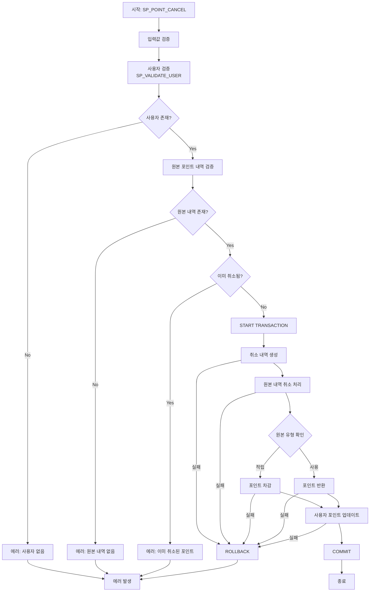

```mermaid
flowchart TD
    A[시작: SP_POINT_CANCEL] --> B[입력값 검증]
    B --> C[사용자 검증<br/>SP_VALIDATE_USER]

    C --> D{사용자 존재?}
    D -->|No| E[에러: 사용자 없음]
    D -->|Yes| F[원본 포인트 내역 검증]

    F --> G{원본 내역 존재?}
    G -->|No| H[에러: 원본 내역 없음]
    G -->|Yes| I{이미 취소됨?}

    I -->|Yes| J[에러: 이미 취소된 포인트]
    I -->|No| K[START TRANSACTION]

    K --> L[취소 내역 생성]
    L --> M[원본 내역 취소 처리]

    M --> N{원본 유형 확인}
    N -->|적립| O[포인트 차감]
    N -->|사용| P[포인트 반환]

    O --> Q[사용자 포인트 업데이트]
    P --> Q
    Q --> R[COMMIT]
    R --> S[종료]

    %% 에러 처리
    E --> T[에러 발생]
    H --> T
    J --> T
    L -->|실패| U[ROLLBACK]
    M -->|실패| U
    O -->|실패| U
    P -->|실패| U
    Q -->|실패| U
    U --> T
```
