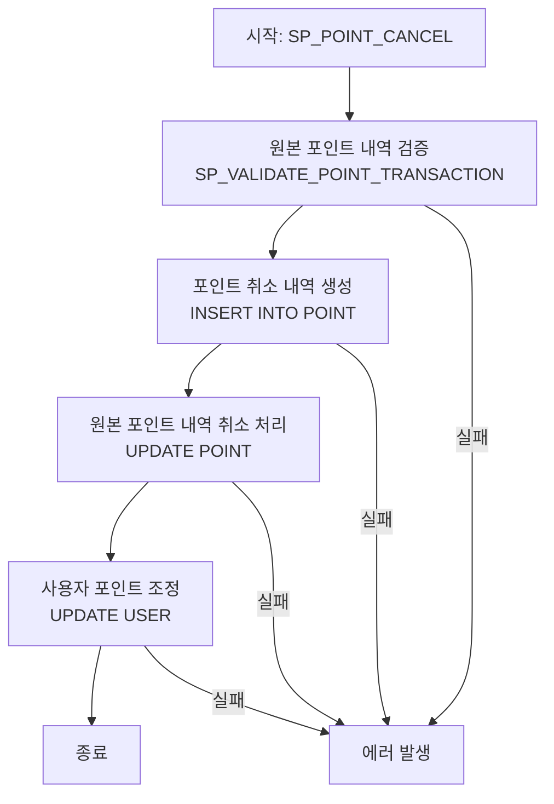

```mermaid
flowchart TD
    A[시작: SP_POINT_CANCEL] --> B[원본 포인트 내역 검증<br/>SP_VALIDATE_POINT_TRANSACTION]

    B --> C[포인트 취소 내역 생성<br/>INSERT INTO POINT]
    C --> D[원본 포인트 내역 취소 처리<br/>UPDATE POINT]
    D --> E[사용자 포인트 조정<br/>UPDATE USER]
    E --> F[종료]

    %% 에러 처리
    B -->|실패| G[에러 발생]
    C -->|실패| G
    D -->|실패| G
    E -->|실패| G
```
