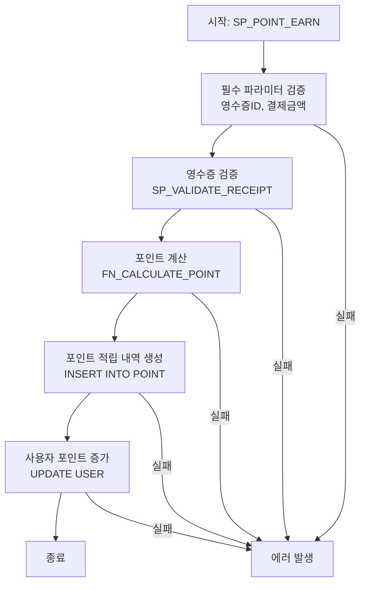

```mermaid
flowchart TD
    A[시작: SP_POINT_EARN] --> B[필수 파라미터 검증<br/>영수증ID, 결제금액]
    B --> C[영수증 검증<br/>SP_VALIDATE_RECEIPT]
    
    C --> D[포인트 계산<br/>FN_CALCULATE_POINT]
    D --> E[포인트 적립 내역 생성<br/>INSERT INTO POINT]
    E --> F[사용자 포인트 증가<br/>UPDATE USER]
    F --> G[종료]

    %% 에러 처리
    B -->|실패| H[에러 발생]
    C -->|실패| H
    D -->|실패| H
    E -->|실패| H
    F -->|실패| H
```