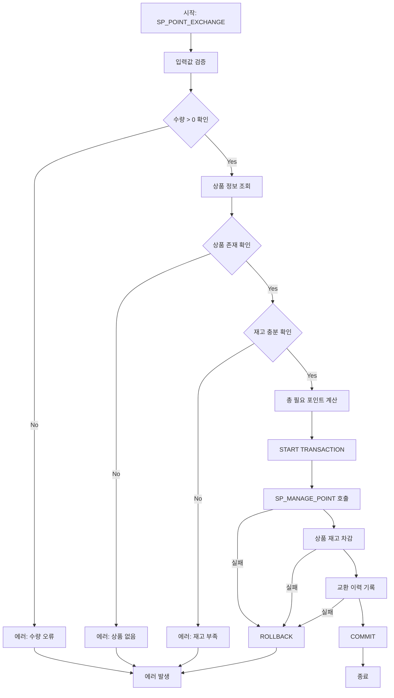

```mermaid
flowchart TD
    A[시작: SP_POINT_EXCHANGE] --> B[입력값 검증]
    B --> C{수량 > 0 확인}
    C -->|No| D[에러: 수량 오류]
    C -->|Yes| E[상품 정보 조회]

    E --> F{상품 존재 확인}
    F -->|No| G[에러: 상품 없음]
    F -->|Yes| H{재고 충분 확인}

    H -->|No| I[에러: 재고 부족]
    H -->|Yes| J[총 필요 포인트 계산]

    %% 트랜잭션 시작
    J --> K[START TRANSACTION]
    K --> L[SP_MANAGE_POINT 호출]
    L --> M[상품 재고 차감]
    M --> N[교환 이력 기록]
    N --> O[COMMIT]
    O --> P[종료]

    %% 에러 처리
    D --> Q[에러 발생]
    G --> Q
    I --> Q
    L -->|실패| R[ROLLBACK]
    M -->|실패| R
    N -->|실패| R
    R --> Q
```
