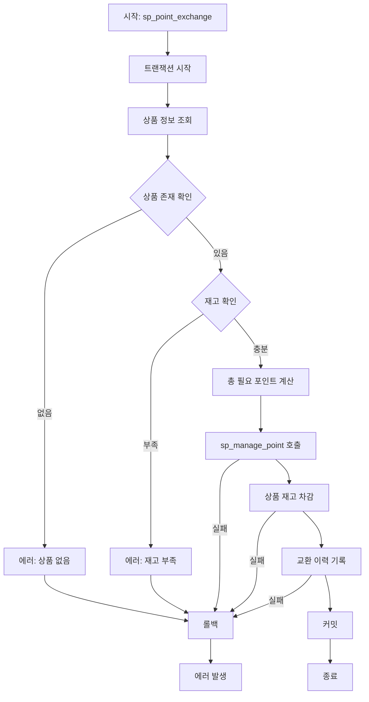

```mermaid
flowchart TD
    A[시작: sp_point_exchange] --> B[트랜잭션 시작]

    B --> C[상품 정보 조회]
    C --> D{상품 존재 확인}
    D -->|없음| E[에러: 상품 없음]
    D -->|있음| F{재고 확인}

    F -->|부족| G[에러: 재고 부족]
    F -->|충분| H[총 필요 포인트 계산]
    H --> I[sp_manage_point 호출]

    I --> J[상품 재고 차감]
    J --> K[교환 이력 기록]
    K --> L[커밋]
    L --> M[종료]

    %% 에러 처리
    E --> N[롤백]
    G --> N
    I -->|실패| N
    J -->|실패| N
    K -->|실패| N
    N --> O[에러 발생]
```
