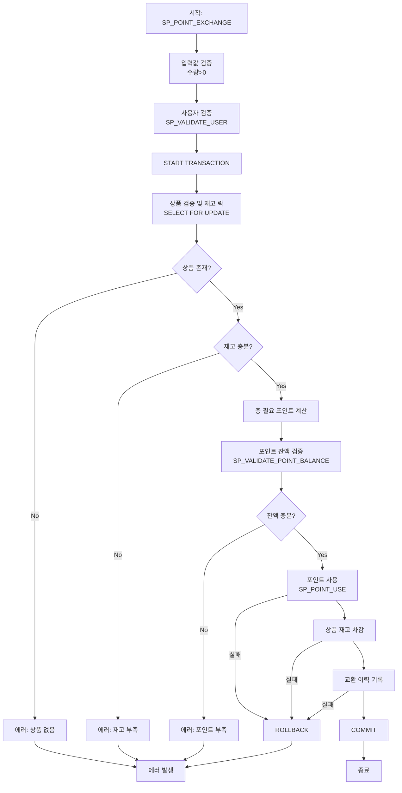

```mermaid
flowchart TD
    A[시작: SP_POINT_EXCHANGE] --> B[입력값 검증<br/>수량>0]
    B --> C[사용자 검증<br/>SP_VALIDATE_USER]

    C --> D[START TRANSACTION]

    D --> E[상품 검증 및 재고 락<br/>SELECT FOR UPDATE]
    E --> F{상품 존재?}
    F -->|No| G[에러: 상품 없음]

    F -->|Yes| H{재고 충분?}
    H -->|No| I[에러: 재고 부족]
    H -->|Yes| J[총 필요 포인트 계산]

    J --> K[포인트 잔액 검증<br/>SP_VALIDATE_POINT_BALANCE]
    K --> L{잔액 충분?}
    L -->|No| M[에러: 포인트 부족]

    L -->|Yes| N[포인트 사용<br/>SP_POINT_USE]
    N --> O[상품 재고 차감]
    O --> P[교환 이력 기록]
    P --> Q[COMMIT]
    Q --> R[종료]

    %% 에러 처리
    G --> S[에러 발생]
    I --> S
    M --> S
    N -->|실패| T[ROLLBACK]
    O -->|실패| T
    P -->|실패| T
    T --> S
```
