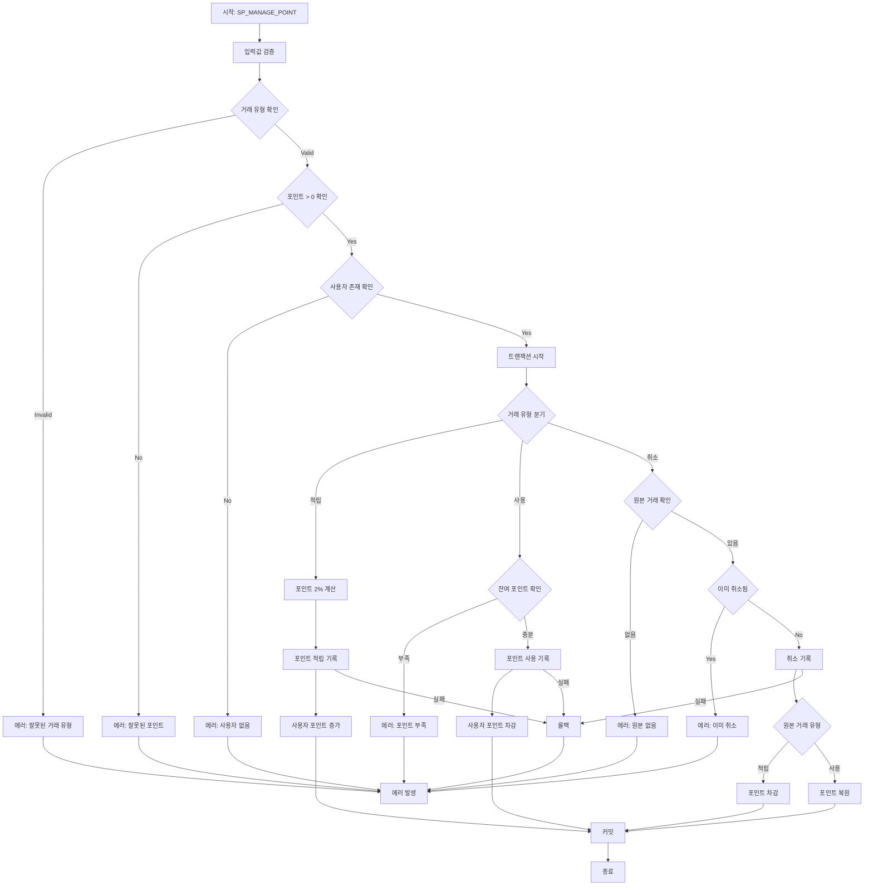

```mermaid
flowchart TD
    A[시작: SP_MANAGE_POINT] --> B[입력값 검증]
    B --> C{거래 유형 확인}
    C -->|Invalid| D[에러: 잘못된 거래 유형]
    C -->|Valid| E{포인트 > 0 확인}

    E -->|No| F[에러: 잘못된 포인트]
    E -->|Yes| G{사용자 존재 확인}

    G -->|No| H[에러: 사용자 없음]
    G -->|Yes| I[트랜잭션 시작]

    I --> J{거래 유형 분기}

    %% 적립 로직
    J -->|적립| K[포인트 2% 계산]
    K --> L[포인트 적립 기록]
    L --> M[사용자 포인트 증가]

    %% 사용 로직
    J -->|사용| N{잔여 포인트 확인}
    N -->|부족| O[에러: 포인트 부족]
    N -->|충분| P[포인트 사용 기록]
    P --> Q[사용자 포인트 차감]

    %% 취소 로직
    J -->|취소| R{원본 거래 확인}
    R -->|없음| S[에러: 원본 없음]
    R -->|있음| T{이미 취소됨}
    T -->|Yes| U[에러: 이미 취소]
    T -->|No| V[취소 기록]
    V --> W{원본 거래 유형}
    W -->|적립| X[포인트 차감]
    W -->|사용| Y[포인트 복원]

    %% 트랜잭션 종료
    M --> Z[커밋]
    Q --> Z
    X --> Z
    Y --> Z
    Z --> AA[종료]

    %% 에러 처리
    D --> BB[에러 발생]
    F --> BB
    H --> BB
    O --> BB
    S --> BB
    U --> BB
    L -->|실패| CC[롤백]
    P -->|실패| CC
    V -->|실패| CC
    CC --> BB
```
