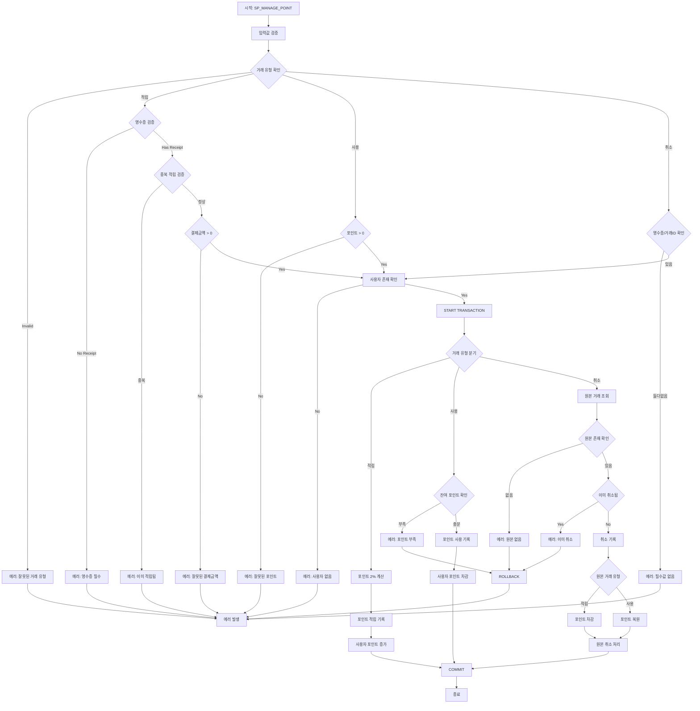

```mermaid
flowchart TD
    A[시작: SP_MANAGE_POINT] --> B[입력값 검증]
    B --> C{거래 유형 확인}
    C -->|Invalid| D[에러: 잘못된 거래 유형]

    C -->|적립| E1{영수증 검증}
    E1 -->|No Receipt| E2[에러: 영수증 필수]
    E1 -->|Has Receipt| E3{중복 적립 검증}
    E3 -->|중복| E4[에러: 이미 적립됨]
    E3 -->|정상| E5{결제금액 > 0}
    E5 -->|No| E6[에러: 잘못된 결제금액]

    C -->|사용| F1{포인트 > 0}
    F1 -->|No| F2[에러: 잘못된 포인트]

    C -->|취소| G1{영수증/거래ID 확인}
    G1 -->|둘다없음| G2[에러: 필수값 없음]

    %% 공통 검증
    E5 -->|Yes| H[사용자 존재 확인]
    F1 -->|Yes| H
    G1 -->|있음| H
    H -->|No| I[에러: 사용자 없음]

    H -->|Yes| J[START TRANSACTION]

    %% 트랜잭션 시작
    J --> K{거래 유형 분기}

    %% 적립 로직
    K -->|적립| L1[포인트 2% 계산]
    L1 --> L2[포인트 적립 기록]
    L2 --> L3[사용자 포인트 증가]

    %% 사용 로직
    K -->|사용| M1{잔여 포인트 확인}
    M1 -->|부족| M2[에러: 포인트 부족]
    M1 -->|충분| M3[포인트 사용 기록]
    M3 --> M4[사용자 포인트 차감]

    %% 취소 로직
    K -->|취소| N1[원본 거래 조회]
    N1 --> N2{원본 존재 확인}
    N2 -->|없음| N3[에러: 원본 없음]
    N2 -->|있음| N4{이미 취소됨}
    N4 -->|Yes| N5[에러: 이미 취소]
    N4 -->|No| N6[취소 기록]
    N6 --> N7{원본 거래 유형}
    N7 -->|적립| N8[포인트 차감]
    N7 -->|사용| N9[포인트 복원]
    N8 --> N10[원본 취소 처리]
    N9 --> N10

    %% 트랜잭션 종료
    L3 --> O[COMMIT]
    M4 --> O
    N10 --> O
    O --> P[종료]

    %% 에러 처리
    D --> Q[에러 발생]
    E2 --> Q
    E4 --> Q
    E6 --> Q
    F2 --> Q
    G2 --> Q
    I --> Q
    M2 --> R[ROLLBACK]
    N3 --> R
    N5 --> R
    R --> Q
```
