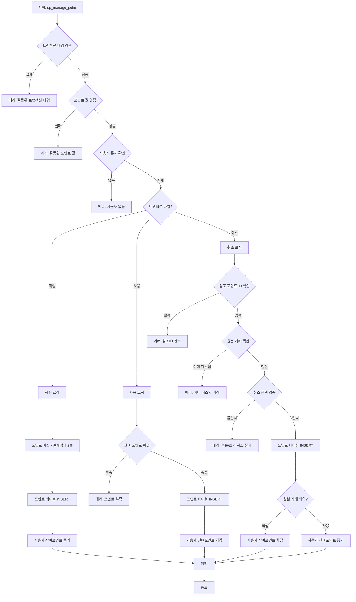

```mermaid
flowchart TD
    A[시작: sp_manage_point] --> B{트랜잭션 타입 검증}
    B -->|실패| C[에러: 잘못된 트랜잭션 타입]
    B -->|성공| D{포인트 값 검증}
    D -->|실패| E[에러: 잘못된 포인트 값]
    D -->|성공| F{사용자 존재 확인}
    F -->|없음| G[에러: 사용자 없음]
    F -->|존재| H{트랜잭션 타입?}

    H -->|적립| I[적립 로직]
    I --> I1[포인트 계산 - 결제액의 2%]
    I1 --> I2[포인트 테이블 INSERT]
    I2 --> I3[사용자 잔여포인트 증가]

    H -->|사용| J[사용 로직]
    J --> J1{잔여 포인트 확인}
    J1 -->|부족| J2[에러: 포인트 부족]
    J1 -->|충분| J3[포인트 테이블 INSERT]
    J3 --> J4[사용자 잔여포인트 차감]

    H -->|취소| K[취소 로직]
    K --> K1{참조 포인트 ID 확인}
    K1 -->|없음| K2[에러: 참조ID 필수]
    K1 -->|있음| K3{원본 거래 확인}
    K3 -->|이미 취소됨| K4[에러: 이미 취소된 거래]
    K3 -->|정상| K5{취소 금액 검증}
    K5 -->|불일치| K6[에러: 부분/초과 취소 불가]
    K5 -->|일치| K7[포인트 테이블 INSERT]
    K7 --> K8{원본 거래 타입?}
    K8 -->|적립| K9[사용자 잔여포인트 차감]
    K8 -->|사용| K10[사용자 잔여포인트 증가]

    I3 --> L[커밋]
    J4 --> L
    K9 --> L
    K10 --> L
    L --> M[종료]

```
