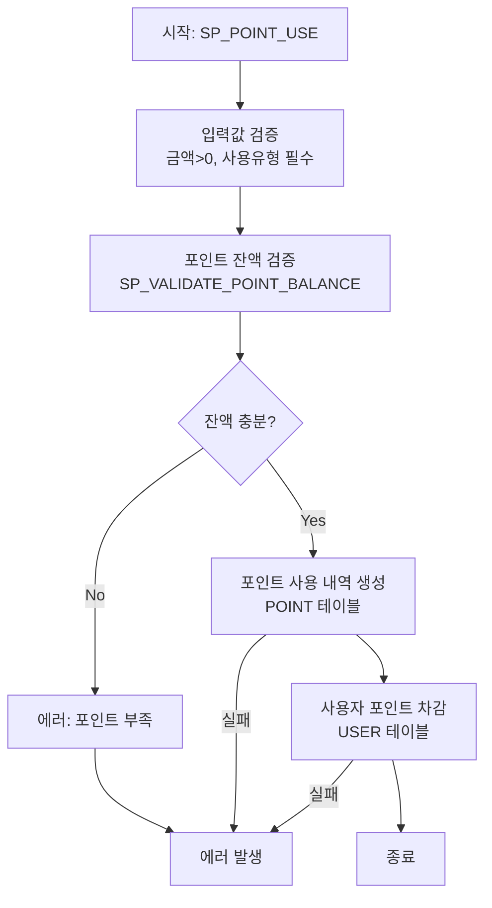

```mermaid
flowchart TD
    A[시작: SP_POINT_USE] --> B[입력값 검증<br/>금액>0, 사용유형 필수]
    B --> F[포인트 잔액 검증<br/>SP_VALIDATE_POINT_BALANCE]

    F --> G{잔액 충분?}
    G -->|No| H[에러: 포인트 부족]
    G -->|Yes| I[포인트 사용 내역 생성<br/>POINT 테이블]

    I --> J[사용자 포인트 차감<br/>USER 테이블]
    J --> K[종료]

    %% 에러 처리
    H --> L[에러 발생]
    I -->|실패| L
    J -->|실패| L
```
