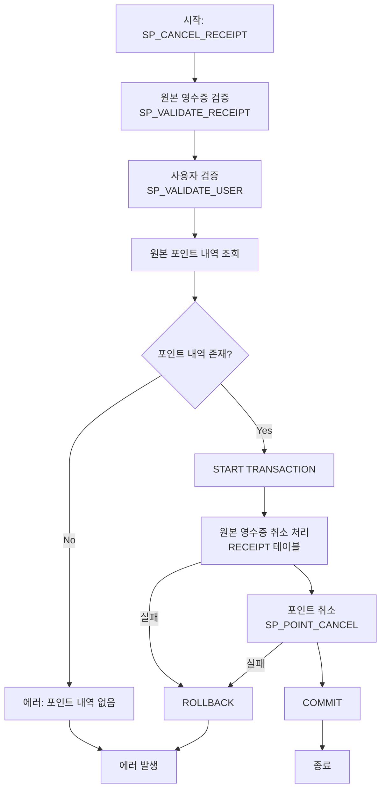

```mermaid
flowchart TD
    A[시작: SP_CANCEL_RECEIPT] --> B[원본 영수증 검증<br/>SP_VALIDATE_RECEIPT]
    B --> C[사용자 검증<br/>SP_VALIDATE_USER]

    C --> D[원본 포인트 내역 조회]
    D --> E{포인트 내역 존재?}
    E -->|No| F[에러: 포인트 내역 없음]
    E -->|Yes| G[START TRANSACTION]

    G --> H[원본 영수증 취소 처리<br/>RECEIPT 테이블]
    H --> I[포인트 취소<br/>SP_POINT_CANCEL]
    I --> J[COMMIT]
    J --> K[종료]

    %% 에러 처리
    F --> L[에러 발생]
    H -->|실패| M[ROLLBACK]
    I -->|실패| M
    M --> L
```
