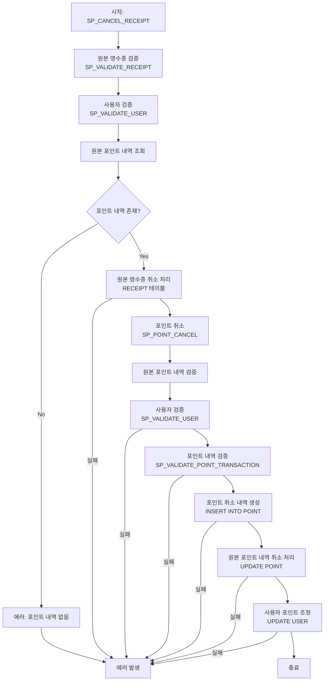

```mermaid
flowchart TD
    A[시작: SP_CANCEL_RECEIPT] --> B[원본 영수증 검증<br/>SP_VALIDATE_RECEIPT]
    B --> C[사용자 검증<br/>SP_VALIDATE_USER]

    C --> D[원본 포인트 내역 조회]
    D --> E{포인트 내역 존재?}
    E -->|No| F[에러: 포인트 내역 없음]
    E -->|Yes| G[원본 영수증 취소 처리<br/>RECEIPT 테이블]

    G --> H[포인트 취소<br/>SP_POINT_CANCEL]
    H --> I[원본 포인트 내역 검증]
    I --> I1[사용자 검증<br/>SP_VALIDATE_USER]
    I1 --> I2[포인트 내역 검증<br/>SP_VALIDATE_POINT_TRANSACTION]
    I2 --> J[포인트 취소 내역 생성<br/>INSERT INTO POINT]
    J --> K[원본 포인트 내역 취소 처리<br/>UPDATE POINT]
    K --> L[사용자 포인트 조정<br/>UPDATE USER]

    L --> M[종료]

    %% 에러 처리
    F --> N[에러 발생]
    G -->|실패| N
    I1 -->|실패| N
    I2 -->|실패| N
    J -->|실패| N
    K -->|실패| N
    L -->|실패| N
```
