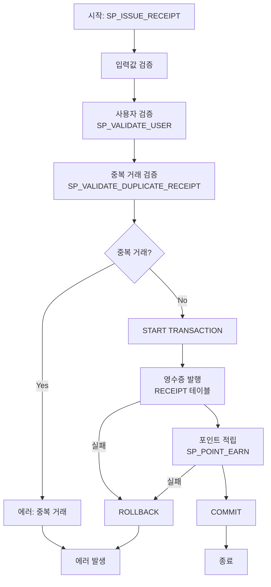

```mermaid
flowchart TD
    A[시작: SP_ISSUE_RECEIPT] --> B[입력값 검증]
    B --> C[사용자 검증<br/>SP_VALIDATE_USER]

    C --> D[중복 거래 검증<br/>SP_VALIDATE_DUPLICATE_RECEIPT]
    D --> E{중복 거래?}
    E -->|Yes| F[에러: 중복 거래]
    E -->|No| G[START TRANSACTION]

    G --> H[영수증 발행<br/>RECEIPT 테이블]
    H --> I[포인트 적립<br/>SP_POINT_EARN]
    I --> J[COMMIT]
    J --> K[종료]

    %% 에러 처리
    F --> L[에러 발생]
    H -->|실패| M[ROLLBACK]
    I -->|실패| M
    M --> L
```
